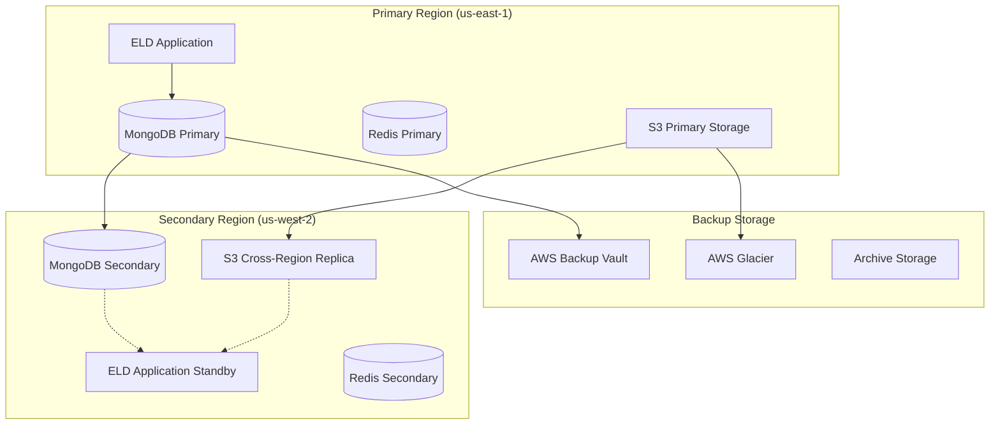

# ELD System - Backup and Disaster Recovery Plan

## 📋 Executive Summary

This comprehensive Backup and Disaster Recovery (BDR) plan ensures the Electronic Logging Device (ELD) system maintains **99.99% availability** with **Recovery Time Objectives (RTO) < 4 hours** and **Recovery Point Objectives (RPO) < 15 minutes**. The plan covers automated backups, point-in-time recovery, multi-region failover, and complete disaster recovery procedures.

### Key Metrics
- **RTO (Recovery Time Objective)**: < 4 hours
- **RPO (Recovery Point Objective)**: < 15 minutes
- **Availability Target**: 99.99% uptime
- **Data Retention**: 7 years for compliance
- **Backup Frequency**: Continuous + hourly snapshots

## 🏗️ Backup Architecture

### Multi-Tier Backup Strategy



### Backup Types and Frequencies

| Component | Backup Type | Frequency | Retention | Storage Location |
|-----------|-------------|-----------|-----------|------------------|
| **MongoDB** | Continuous Backup | Real-time | 7 years | MongoDB Atlas + S3 |
| **Application Data** | Point-in-time | Every 6 hours | 30 days | S3 + Glacier |
| **Configuration** | Incremental | Daily | 90 days | S3 Versioning |
| **Application Code** | Git Backup | On commit | Indefinite | GitHub + S3 |
| **Logs** | Streaming | Real-time | 30 days hot, 7 years cold | CloudWatch + S3 |
| **Secrets** | Encrypted Backup | Daily | 30 days | AWS Secrets Manager |
| **User Files** | Incremental | Hourly | 1 year | S3 + Cross-region |

## 🔄 Automated Backup Implementation

### MongoDB Backup Strategy

```javascript
// MongoDB Automated Backup Service
class MongoBackupService {
  constructor() {
    this.backupConfig = {
      continuous: {
        enabled: true,
        retentionPeriod: 7 * 365, // 7 years in days
        oplogSize: '50GB'
      },
      pointInTime: {
        enabled: true,
        snapshotWindow: '03:00-05:00',
        frequency: 'hourly'
      },
      crossRegion: {
        enabled: true,
        targetRegion: 'us-west-2',
        encryptionKey: 'alias/backup-key'
      }
    };
  }

  async createBackup(type = 'snapshot') {
    const backupId = `backup_${Date.now()}_${Math.random().toString(36).substr(2, 9)}`;
    
    try {
      const backup = {
        id: backupId,
        timestamp: new Date(),
        type: type,
        status: 'initiated',
        metadata: {
          databaseSize: await this.getDatabaseSize(),
          collections: await this.getCollectionList(),
          indexes: await this.getIndexStats()
        }
      };

      // Create backup job
      await this.initiateBackupJob(backup);
      
      // Monitor backup progress
      this.monitorBackupProgress(backupId);
      
      return backup;
    } catch (error) {
      console.error(`Backup creation failed: ${error.message}`);
      await this.alertBackupFailure(backupId, error);
      throw error;
    }
  }

  async restoreFromBackup(backupId, targetTimestamp = null) {
    const restoreId = `restore_${Date.now()}_${Math.random().toString(36).substr(2, 9)}`;
    
    try {
      const restore = {
        id: restoreId,
        backupId: backupId,
        targetTimestamp: targetTimestamp,
        status: 'initiated',
        estimatedTime: await this.estimateRestoreTime(backupId)
      };

      // Validate backup integrity
      await this.validateBackupIntegrity(backupId);
      
      // Create restore cluster
      const restoreCluster = await this.createRestoreCluster(restoreId);
      
      // Initiate restore process
      await this.initiateRestore(restoreCluster, backupId, targetTimestamp);
      
      return restore;
    } catch (error) {
      console.error(`Restore failed: ${error.message}`);
      throw error;
    }
  }

  async performPointInTimeRecovery(targetTimestamp) {
    console.log(`Initiating point-in-time recovery to ${targetTimestamp}`);
    
    // Find closest backup before target time
    const baseBackup = await this.findBaseBackup(targetTimestamp);
    
    // Apply oplog entries up to target time
    const oplogEntries = await this.getOplogEntries(baseBackup.timestamp, targetTimestamp);
    
    // Create recovery cluster
    const recoveryCluster = await this.createRecoveryCluster();
    
    // Restore base backup
    await this.restoreBaseBackup(recoveryCluster, baseBackup);
    
    // Apply oplog entries
    await this.applyOplogEntries(recoveryCluster, oplogEntries);
    
    return {
      clusterId: recoveryCluster.id,
      targetTimestamp: targetTimestamp,
      status: 'completed'
    };
  }
}
```

### Application Backup Service

```javascript
// Comprehensive Application Backup Service
class ApplicationBackupService {
  constructor() {
    this.backupSchedules = {
      full: '0 2 * * 0',        // Weekly full backup (Sunday 2 AM)
      incremental: '0 */6 * * *', // Every 6 hours
      logs: '*/5 * * * *',       // Every 5 minutes
      config: '0 1 * * *'        // Daily at 1 AM
    };
    
    this.retentionPolicies = {
      full: 90,         // 90 days
      incremental: 30,  // 30 days
      logs: 30,         // 30 days hot, then archive
      config: 365       // 1 year
    };
  }

  async performFullBackup() {
    const backupId = this.generateBackupId('full');
    const timestamp = new Date();
    
    try {
      // Create backup manifest
      const manifest = await this.createBackupManifest(backupId, 'full');
      
      // Backup application files
      const appFilesBackup = await this.backupApplicationFiles(backupId);
      
      // Backup configuration
      const configBackup = await this.backupConfiguration(backupId);
      
      // Backup user-uploaded files
      const userFilesBackup = await this.backupUserFiles(backupId);
      
      // Backup logs
      const logsBackup = await this.backupLogs(backupId);
      
      // Create archive
      const archive = await this.createBackupArchive(backupId, {
        manifest,
        appFiles: appFilesBackup,
        config: configBackup,
        userFiles: userFilesBackup,
        logs: logsBackup
      });
      
      // Upload to S3 and replicate
      await this.uploadAndReplicate(archive);
      
      // Update backup registry
      await this.registerBackup(backupId, manifest);
      
      console.log(`✅ Full backup completed: ${backupId}`);
      return { id: backupId, status: 'completed', size: archive.size };
      
    } catch (error) {
      console.error(`❌ Full backup failed: ${error.message}`);
      await this.handleBackupFailure(backupId, error);
      throw error;
    }
  }

  async performIncrementalBackup() {
    const backupId = this.generateBackupId('incremental');
    const lastBackup = await this.getLastBackup('incremental');
    
    try {
      // Find changes since last backup
      const changes = await this.detectChanges(lastBackup.timestamp);
      
      if (changes.length === 0) {
        console.log('No changes detected, skipping incremental backup');
        return { id: backupId, status: 'skipped', reason: 'no_changes' };
      }
      
      // Create incremental backup
      const incrementalData = await this.createIncrementalBackup(changes);
      
      // Upload and replicate
      await this.uploadAndReplicate(incrementalData);
      
      // Update backup chain
      await this.updateBackupChain(backupId, lastBackup.id);
      
      console.log(`✅ Incremental backup completed: ${backupId}`);
      return { id: backupId, status: 'completed', changes: changes.length };
      
    } catch (error) {
      console.error(`❌ Incremental backup failed: ${error.message}`);
      throw error;
    }
  }
}
```

## 🌍 Multi-Region Disaster Recovery

### Geographic Distribution

| Region | Role | Components | Failover Time |
|--------|------|------------|---------------|
| **us-east-1** | Primary | All services, Primary DB | N/A |
| **us-west-2** | Hot Standby | All services, Replica DB | < 15 minutes |
| **eu-west-1** | Cold Standby | Backup storage only | < 4 hours |

### Automated Failover Process

```javascript
// Disaster Recovery Orchestration Service
class DisasterRecoveryOrchestrator {
  constructor() {
    this.regions = {
      primary: 'us-east-1',
      secondary: 'us-west-2',
      tertiary: 'eu-west-1'
    };
    
    this.failoverThresholds = {
      healthCheckFailures: 3,
      responseTimeThreshold: 10000, // 10 seconds
      errorRateThreshold: 0.1,      // 10%
      unavailabilityDuration: 300   // 5 minutes
    };
    
    this.currentState = 'normal';
  }

  async initiateFailover(reason, targetRegion = this.regions.secondary) {
    const failoverId = `failover_${Date.now()}`;
    
    console.log(`🚨 Initiating failover ${failoverId}: ${reason}`);
    
    try {
      // Step 1: Validate secondary region health
      const secondaryHealth = await this.checkRegionHealth(targetRegion);
      if (!secondaryHealth.healthy) {
        throw new Error(`Secondary region ${targetRegion} is not healthy`);
      }
      
      // Step 2: Stop traffic to primary region
      await this.stopTrafficToPrimary();
      
      // Step 3: Promote secondary database to primary
      await this.promoteSecondaryDatabase(targetRegion);
      
      // Step 4: Update DNS to point to secondary region
      await this.updateDNSRecords(targetRegion);
      
      // Step 5: Scale up services in secondary region
      await this.scaleUpSecondaryServices(targetRegion);
      
      // Step 6: Update application configuration
      await this.updateApplicationConfig(targetRegion);
      
      // Step 7: Verify failover completion
      await this.verifyFailoverCompletion(targetRegion);
      
      // Step 8: Notify stakeholders
      await this.notifyFailoverCompletion(failoverId, targetRegion);
      
      this.currentState = 'failover_active';
      this.activeRegion = targetRegion;
      
      console.log(`✅ Failover ${failoverId} completed successfully`);
      return { id: failoverId, status: 'completed', activeRegion: targetRegion };
      
    } catch (error) {
      console.error(`❌ Failover ${failoverId} failed: ${error.message}`);
      await this.handleFailoverFailure(failoverId, error);
      throw error;
    }
  }

  async initiateFailback(targetRegion = this.regions.primary) {
    const failbackId = `failback_${Date.now()}`;
    
    console.log(`🔄 Initiating failback ${failbackId} to ${targetRegion}`);
    
    try {
      // Step 1: Verify primary region is healthy
      const primaryHealth = await this.checkRegionHealth(targetRegion);
      if (!primaryHealth.healthy) {
        throw new Error(`Primary region ${targetRegion} is not healthy for failback`);
      }
      
      // Step 2: Sync data from active region to primary
      await this.syncDataForFailback(this.activeRegion, targetRegion);
      
      // Step 3: Gradually shift traffic back
      await this.gradualTrafficShift(this.activeRegion, targetRegion);
      
      // Step 4: Complete failback
      await this.completeFailback(targetRegion);
      
      this.currentState = 'normal';
      this.activeRegion = targetRegion;
      
      console.log(`✅ Failback ${failbackId} completed successfully`);
      return { id: failbackId, status: 'completed' };
      
    } catch (error) {
      console.error(`❌ Failback ${failbackId} failed: ${error.message}`);
      throw error;
    }
  }
}
```

### Health Monitoring and Auto-Failover

```javascript
// Automated Disaster Detection and Response
class DisasterDetectionService {
  constructor() {
    this.healthChecks = [
      'database_connectivity',
      'application_response',
      'external_dependencies',
      'resource_availability',
      'security_posture'
    ];
    
    this.checkInterval = 30000; // 30 seconds
    this.alertThresholds = {
      consecutive_failures: 3,
      response_time_ms: 10000,
      error_rate_percent: 10,
      availability_percent: 95
    };
  }

  async monitorSystemHealth() {
    while (true) {
      try {
        const healthStatus = await this.performComprehensiveHealthCheck();
        
        if (this.shouldTriggerFailover(healthStatus)) {
          const reason = this.determineFailoverReason(healthStatus);
          await this.triggerAutomatedFailover(reason);
        }
        
        // Store health metrics
        await this.storeHealthMetrics(healthStatus);
        
      } catch (error) {
        console.error('Health monitoring error:', error);
      }
      
      await this.sleep(this.checkInterval);
    }
  }

  shouldTriggerFailover(healthStatus) {
    const criticalFailures = healthStatus.checks.filter(check => 
      check.critical && !check.healthy
    );
    
    return criticalFailures.length > 0 || 
           healthStatus.overallHealth < this.alertThresholds.availability_percent;
  }
}
```

## 📊 Recovery Testing and Validation

### Automated Recovery Testing

```yaml
# Recovery Testing Schedule
Recovery_Testing:
  Backup_Restoration:
    frequency: weekly
    scope: sample_data_restoration
    validation: data_integrity_check
    
  Failover_Testing:
    frequency: quarterly  
    scope: full_system_failover
    validation: end_to_end_functionality
    
  Disaster_Simulation:
    frequency: annually
    scope: complete_disaster_scenario
    validation: business_continuity
    
  Recovery_Procedures:
    frequency: monthly
    scope: procedural_validation
    validation: team_readiness
```

### Test Automation Framework

```javascript
// Automated Recovery Testing Framework
class RecoveryTestFramework {
  constructor() {
    this.testSuites = [
      'backup_integrity',
      'restore_functionality', 
      'failover_performance',
      'data_consistency',
      'application_functionality',
      'compliance_validation'
    ];
  }

  async runRecoveryTests(testType = 'comprehensive') {
    const testRun = {
      id: `test_${Date.now()}`,
      type: testType,
      startTime: new Date(),
      results: {}
    };

    try {
      // Test 1: Backup Integrity
      testRun.results.backupIntegrity = await this.testBackupIntegrity();
      
      // Test 2: Point-in-time Recovery
      testRun.results.pointInTimeRecovery = await this.testPointInTimeRecovery();
      
      // Test 3: Cross-region Failover
      testRun.results.crossRegionFailover = await this.testCrossRegionFailover();
      
      // Test 4: Data Consistency
      testRun.results.dataConsistency = await this.testDataConsistency();
      
      // Test 5: Application Functionality Post-Recovery
      testRun.results.functionalityTest = await this.testApplicationFunctionality();
      
      // Test 6: Performance Post-Recovery
      testRun.results.performanceTest = await this.testPerformancePostRecovery();
      
      testRun.endTime = new Date();
      testRun.duration = testRun.endTime - testRun.startTime;
      testRun.status = this.determineOverallTestStatus(testRun.results);
      
      // Generate test report
      await this.generateTestReport(testRun);
      
      return testRun;
      
    } catch (error) {
      testRun.error = error.message;
      testRun.status = 'failed';
      throw error;
    }
  }
}
```

## 🔐 Security and Compliance

### Backup Encryption and Security

```javascript
// Secure Backup Management
class SecureBackupManager {
  constructor() {
    this.encryptionConfig = {
      algorithm: 'aes-256-gcm',
      keyRotationPeriod: 90, // days
      encryptionAtRest: true,
      encryptionInTransit: true
    };
  }

  async createEncryptedBackup(data, backupId) {
    // Generate unique encryption key for this backup
    const backupKey = await this.generateBackupKey(backupId);
    
    // Encrypt backup data
    const encryptedData = await this.encryptBackupData(data, backupKey);
    
    // Store encryption key securely
    await this.storeEncryptionKey(backupId, backupKey);
    
    // Add integrity hash
    const integrityHash = await this.calculateIntegrityHash(encryptedData);
    
    return {
      backupId,
      encryptedData,
      integrityHash,
      keyId: backupKey.keyId,
      timestamp: new Date()
    };
  }

  async validateBackupIntegrity(backupId) {
    const backup = await this.getBackup(backupId);
    const currentHash = await this.calculateIntegrityHash(backup.encryptedData);
    
    if (currentHash !== backup.integrityHash) {
      throw new Error(`Backup integrity validation failed for ${backupId}`);
    }
    
    return true;
  }
}
```

### Compliance and Audit Trail

```yaml
# Compliance Requirements for Backup and Recovery
Compliance_Framework:
  Data_Retention:
    FMCSA: 3_years
    GDPR: 7_years_audit_logs
    CCPA: 2_years_personal_data
    SOX: 7_years_financial_data
    
  Backup_Requirements:
    encryption: AES_256_minimum
    geographic_distribution: required
    access_logging: comprehensive
    integrity_verification: mandatory
    
  Recovery_Testing:
    frequency: quarterly_minimum
    documentation: required
    stakeholder_notification: mandatory
    compliance_validation: required
```

## 📞 Emergency Response Procedures

### Incident Response Team

| Role | Primary Contact | Backup Contact | Responsibilities |
|------|----------------|----------------|------------------|
| **Incident Commander** | John Smith | Jane Doe | Overall coordination |
| **Technical Lead** | Mike Johnson | Sarah Wilson | Technical decisions |
| **Database Admin** | Alex Chen | David Kim | Database recovery |
| **Security Lead** | Lisa Brown | Tom Garcia | Security assessment |
| **Communications** | Rachel Green | Mark Taylor | Stakeholder updates |

### Emergency Contact Procedures

```yaml
Emergency_Response:
  Severity_1_Critical:
    notification: immediate
    escalation: 15_minutes
    response_time: 30_minutes
    contacts:
      - emergency_hotline: +1-555-0199
      - pagerduty: critical_incidents
      - slack: "#incident-response"
      
  Severity_2_High:
    notification: within_1_hour
    escalation: 2_hours
    response_time: 4_hours
    
  Severity_3_Medium:
    notification: within_4_hours
    escalation: next_business_day
    response_time: 24_hours
```

### Recovery Playbooks

#### Database Recovery Playbook

```bash
#!/bin/bash
# Emergency Database Recovery Playbook

echo "🚨 EMERGENCY DATABASE RECOVERY INITIATED"
echo "Timestamp: $(date)"

# Step 1: Assess damage
echo "Step 1: Assessing database status..."
./scripts/assess-database-health.sh

# Step 2: Identify latest valid backup
echo "Step 2: Identifying latest valid backup..."
LATEST_BACKUP=$(./scripts/find-latest-backup.sh)
echo "Latest backup: $LATEST_BACKUP"

# Step 3: Initiate recovery
echo "Step 3: Initiating recovery from backup..."
./scripts/initiate-recovery.sh --backup-id="$LATEST_BACKUP" --target-time="$TARGET_TIME"

# Step 4: Validate recovery
echo "Step 4: Validating recovery..."
./scripts/validate-recovery.sh

# Step 5: Resume operations
echo "Step 5: Resuming normal operations..."
./scripts/resume-operations.sh

echo "✅ DATABASE RECOVERY COMPLETED"
```

#### Application Recovery Playbook

```bash
#!/bin/bash
# Application Recovery Playbook

echo "🚨 APPLICATION RECOVERY INITIATED"

# Step 1: Stop affected services
echo "Stopping affected services..."
kubectl scale deployment/eld-api --replicas=0

# Step 2: Restore application state
echo "Restoring application state..."
./scripts/restore-application-state.sh

# Step 3: Update configuration
echo "Updating configuration..."
./scripts/update-recovery-config.sh

# Step 4: Restart services
echo "Restarting services..."
kubectl scale deployment/eld-api --replicas=3

# Step 5: Verify functionality
echo "Verifying functionality..."
./scripts/verify-application-health.sh

echo "✅ APPLICATION RECOVERY COMPLETED"
```

## 📈 Performance Metrics and SLA Monitoring

### Recovery Performance Metrics

| Metric | Target | Measurement |
|--------|---------|-------------|
| **RTO** | < 4 hours | Time to restore service |
| **RPO** | < 15 minutes | Maximum data loss |
| **Backup Success Rate** | > 99.9% | Successful backups / Total backups |
| **Recovery Success Rate** | > 99% | Successful recoveries / Total attempts |
| **Failover Time** | < 15 minutes | Time to complete failover |
| **Data Integrity** | 100% | Post-recovery validation success |

### Monitoring Dashboard

```javascript
// Recovery Metrics Dashboard
class RecoveryMetricsDashboard {
  async getRecoveryMetrics(timeRange = '30d') {
    return {
      rto: {
        average: await this.calculateAverageRTO(timeRange),
        p95: await this.calculateP95RTO(timeRange),
        target: '4 hours'
      },
      rpo: {
        average: await this.calculateAverageRPO(timeRange),
        maximum: await this.calculateMaxRPO(timeRange),
        target: '15 minutes'
      },
      backupSuccess: {
        rate: await this.getBackupSuccessRate(timeRange),
        target: '99.9%'
      },
      recoveryTests: {
        passed: await this.getRecoveryTestsPassed(timeRange),
        total: await this.getTotalRecoveryTests(timeRange),
        successRate: await this.getRecoveryTestSuccessRate(timeRange)
      },
      incidents: {
        total: await this.getTotalIncidents(timeRange),
        resolved: await this.getResolvedIncidents(timeRange),
        averageResolutionTime: await this.getAverageResolutionTime(timeRange)
      }
    };
  }
}
```

## 🔄 Continuous Improvement

### Regular Review Process

```yaml
Review_Schedule:
  Weekly:
    - backup_status_review
    - health_check_analysis
    - incident_review
    
  Monthly:
    - recovery_test_results
    - performance_metrics_analysis
    - procedure_updates
    
  Quarterly:
    - comprehensive_dr_test
    - sla_performance_review
    - stakeholder_feedback
    
  Annually:
    - complete_plan_review
    - technology_assessment
    - training_requirements
```

### Plan Maintenance

1. **Regular Updates**: Plans updated quarterly or after major incidents
2. **Technology Refresh**: Infrastructure and tools reviewed annually
3. **Training**: Team training conducted bi-annually
4. **Documentation**: All procedures documented and version controlled
5. **Compliance**: Regular compliance audits and updates

---

## 📋 Implementation Checklist

### Phase 1: Foundation (Week 1-2)
- [ ] Set up automated backup infrastructure
- [ ] Configure cross-region replication
- [ ] Implement backup encryption
- [ ] Create backup monitoring

### Phase 2: Recovery Capabilities (Week 3-4)
- [ ] Implement point-in-time recovery
- [ ] Set up automated failover
- [ ] Create recovery testing framework
- [ ] Document recovery procedures

### Phase 3: Monitoring and Alerting (Week 5-6)
- [ ] Deploy health monitoring systems
- [ ] Configure disaster detection
- [ ] Set up incident response workflows
- [ ] Create recovery dashboards

### Phase 4: Testing and Validation (Week 7-8)
- [ ] Conduct comprehensive recovery tests
- [ ] Validate all recovery procedures
- [ ] Train incident response team
- [ ] Obtain stakeholder sign-off

---

This comprehensive backup and disaster recovery plan ensures your ELD system can withstand any disaster scenario while maintaining regulatory compliance and business continuity. The plan includes automated processes, detailed procedures, and continuous monitoring to guarantee reliable data protection and rapid recovery capabilities.
