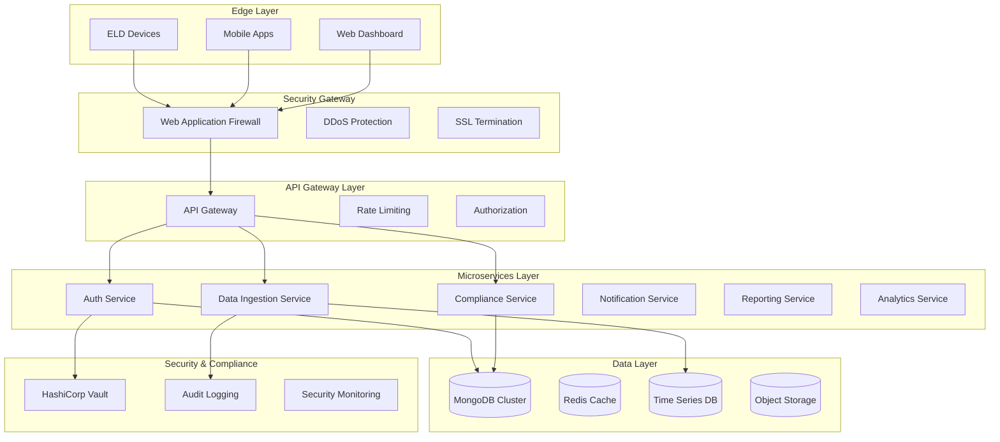

# ELD System Architecture - Robust, Scalable & Secure

## 🏗️ System Overview

The Electronic Logging Device (ELD) system is designed to handle massive amounts of sensitive transportation data while ensuring compliance with federal regulations, data privacy laws, and maintaining high availability and security standards.

### Core Principles
- **Security First**: End-to-end encryption, zero-trust architecture
- **Regulatory Compliance**: FMCSA, GDPR, CCPA, SOC 2 compliance
- **Massive Scalability**: Handle millions of devices and billions of data points
- **High Availability**: 99.99% uptime with disaster recovery
- **Data Privacy**: Advanced anonymization and consent management

## 🌐 High-Level Architecture



## 🔐 Security Architecture

### Zero-Trust Security Model

#### 1. Multi-Layer Authentication
```javascript
// Enhanced authentication flow
const authFlow = {
  deviceAuth: "mTLS certificates + device attestation",
  userAuth: "Multi-factor authentication (MFA)",
  apiAuth: "OAuth 2.0 + JWT with short expiry",
  serviceAuth: "Service mesh mTLS"
};
```

#### 2. Encryption Standards
- **Data at Rest**: AES-256 encryption with AWS KMS/Azure Key Vault
- **Data in Transit**: TLS 1.3 with perfect forward secrecy
- **Application Layer**: Field-level encryption for PII
- **Database**: Transparent Data Encryption (TDE)

#### 3. Network Security
```yaml
# Security groups and network policies
NetworkSecurity:
  VPC:
    - Private subnets for databases
    - Public subnets for load balancers only
  WAF:
    - SQL injection protection
    - XSS filtering
    - Rate limiting by IP/user
  DDoS:
    - AWS Shield Advanced
    - CloudFlare protection
```

## 🗄️ Database Architecture

### MongoDB Cluster Design

#### 1. Sharded Cluster Configuration
```javascript
// MongoDB sharding strategy for massive scale
const shardingConfig = {
  shardKey: {
    carrierId: "hashed",    // Distribute by carrier
    timestamp: "ranged"     // Time-based distribution
  },
  replication: {
    replica_sets: 3,        // Primary + 2 secondaries per shard
    read_preference: "secondaryPreferred"
  },
  indexing: {
    compound_indexes: [
      { carrierId: 1, driverId: 1, timestamp: -1 },
      { deviceId: 1, timestamp: -1 },
      { location: "2dsphere", timestamp: -1 }
    ]
  }
};
```

#### 2. Data Partitioning Strategy
```javascript
// Time-based and geographic partitioning
const partitionStrategy = {
  timePartitions: {
    hot_data: "last_30_days",      // High-performance SSD
    warm_data: "30_days_to_2_years", // Standard storage
    cold_data: "older_than_2_years"  // Archive storage
  },
  geographicShards: {
    us_east: ["NY", "FL", "VA", "GA"],
    us_west: ["CA", "OR", "WA", "AZ"],
    us_central: ["TX", "IL", "OH", "MI"]
  }
};
```

#### 3. Performance Optimization
```javascript
const performanceConfig = {
  connectionPool: {
    maxPoolSize: 100,
    minPoolSize: 10,
    maxIdleTimeMS: 30000,
    serverSelectionTimeoutMS: 5000
  },
  readConcern: "majority",
  writeConcern: { w: "majority", j: true, wtimeout: 5000 },
  caching: {
    redis_ttl: 300,
    query_cache: true,
    result_cache: 3600
  }
};
```

### Time Series Database (InfluxDB)
```javascript
// High-frequency ELD data storage
const influxConfig = {
  retention_policies: {
    real_time: "7d",      // 1-second precision
    hourly: "90d",        // 1-minute aggregates
    daily: "2y",          // 1-hour aggregates
    monthly: "forever"    // Daily aggregates
  },
  measurement_structure: {
    vehicle_location: {
      tags: ["device_id", "driver_id", "carrier_id"],
      fields: ["lat", "lng", "speed", "heading", "odometer"],
      precision: "s"
    },
    engine_data: {
      tags: ["device_id", "engine_id"],
      fields: ["rpm", "fuel_level", "engine_hours", "diagnostics"],
      precision: "s"
    }
  }
};
```

## 🚀 Cloud Infrastructure

### AWS Architecture
```yaml
# Infrastructure as Code (Terraform)
Production_Environment:
  Regions:
    Primary: us-east-1
    Secondary: us-west-2
    
  Compute:
    ECS_Fargate:
      - Auto-scaling groups
      - Health checks
      - Blue-green deployments
    
  Storage:
    RDS:
      - MongoDB Atlas Professional
      - Multi-AZ deployment
      - Read replicas
    S3:
      - Versioning enabled
      - Cross-region replication
      - Lifecycle policies
      
  Network:
    VPC:
      - Multiple availability zones
      - Private/public subnets
      - NAT gateways
    ALB:
      - SSL termination
      - Health checks
      - Sticky sessions
      
  Security:
    KMS:
      - Customer managed keys
      - Key rotation
    IAM:
      - Principle of least privilege
      - Service roles
    CloudTrail:
      - All API calls logged
      - Integrity validation
```

### Kubernetes Deployment
```yaml
# Kubernetes configuration for microservices
apiVersion: apps/v1
kind: Deployment
metadata:
  name: eld-data-service
spec:
  replicas: 5
  strategy:
    type: RollingUpdate
    rollingUpdate:
      maxUnavailable: 1
      maxSurge: 2
  template:
    spec:
      containers:
      - name: eld-data-service
        image: eld/data-service:v1.2.0
        resources:
          requests:
            memory: "512Mi"
            cpu: "500m"
          limits:
            memory: "1Gi"
            cpu: "1000m"
        env:
        - name: MONGODB_URI
          valueFrom:
            secretKeyRef:
              name: db-credentials
              key: uri
        livenessProbe:
          httpGet:
            path: /health
            port: 8080
          initialDelaySeconds: 30
          periodSeconds: 10
```

## 📊 Data Flow Architecture

### Real-Time Data Pipeline
```javascript
// High-throughput data ingestion pipeline
const dataFlow = {
  ingestion: {
    source: "ELD devices",
    protocol: "MQTT/WebSocket",
    format: "JSON/Protobuf",
    frequency: "1-5 seconds",
    volume: "1M+ messages/second"
  },
  
  processing: {
    stream_processing: "Apache Kafka + Kafka Streams",
    batch_processing: "Apache Spark",
    real_time_analytics: "Apache Flink"
  },
  
  storage: {
    hot_path: "InfluxDB (real-time queries)",
    warm_path: "MongoDB (operational data)",
    cold_path: "S3 + Parquet (historical analytics)"
  }
};
```

### Message Queue Architecture
```yaml
Apache_Kafka_Cluster:
  Topics:
    eld-raw-data:
      partitions: 50
      replication-factor: 3
      retention: 7d
      
    compliance-events:
      partitions: 10
      replication-factor: 3
      retention: 30d
      
    audit-logs:
      partitions: 20
      replication-factor: 3
      retention: 7y
      
  Consumer_Groups:
    - data-processor
    - compliance-checker
    - audit-logger
    - analytics-engine
```

## 🛡️ Compliance & Audit Framework

### FMCSA Compliance
```javascript
const fmcsaCompliance = {
  data_retention: {
    eld_records: "3_years",
    driver_logs: "6_months_current_plus_7_previous_days",
    inspection_reports: "3_years"
  },
  
  data_elements: [
    "date", "time", "location", "engine_hours",
    "vehicle_miles", "driver_identification",
    "co_driver_identification", "shipping_document_number"
  ],
  
  edit_rights: {
    driver: ["duty_status_annotations", "location_if_inaccurate"],
    carrier: ["review_and_certify"],
    enforcement: ["request_transfer"]
  }
};
```

### GDPR/CCPA Privacy Controls
```javascript
const privacyControls = {
  consent_management: {
    granular_consent: true,
    withdrawal_mechanism: "one_click",
    consent_proof: "cryptographic_signature"
  },
  
  data_subject_rights: {
    access: "automated_export_within_30_days",
    rectification: "real_time_updates",
    erasure: "right_to_be_forgotten_workflow",
    portability: "standardized_json_export"
  },
  
  privacy_by_design: {
    data_minimization: true,
    purpose_limitation: true,
    storage_limitation: true,
    pseudonymization: true
  }
};
```

## 📈 Scalability Design

### Auto-Scaling Configuration
```yaml
Auto_Scaling:
  Horizontal_Scaling:
    API_Services:
      min_instances: 3
      max_instances: 100
      target_cpu: 70%
      target_memory: 80%
      
    Data_Ingestion:
      min_instances: 5
      max_instances: 200
      target_throughput: 10000_rps
      
  Vertical_Scaling:
    Database:
      automatic_scaling: true
      max_compute: 64_vcpu
      max_storage: 10_TB
      
  Geographic_Scaling:
    edge_locations: 15
    cdn_distribution: global
    regional_databases: 3
```

### Performance Targets
```javascript
const performanceTargets = {
  api_response_time: {
    p95: "< 200ms",
    p99: "< 500ms"
  },
  
  data_ingestion: {
    throughput: "1M+ events/second",
    latency: "< 100ms end-to-end"
  },
  
  availability: {
    uptime: "99.99%",
    rto: "< 4 hours",  // Recovery Time Objective
    rpo: "< 15 minutes" // Recovery Point Objective
  },
  
  scalability: {
    concurrent_users: "100K+",
    concurrent_devices: "10M+",
    data_storage: "Petabyte scale"
  }
};
```

## 🔍 Monitoring & Observability

### Comprehensive Monitoring Stack
```yaml
Monitoring_Stack:
  Metrics:
    - Prometheus + Grafana
    - Custom business metrics
    - Infrastructure metrics
    
  Logging:
    - Centralized logging with ELK Stack
    - Structured JSON logging
    - Log aggregation and analysis
    
  Tracing:
    - Distributed tracing with Jaeger
    - Request flow visualization
    - Performance bottleneck identification
    
  Alerting:
    - PagerDuty integration
    - Slack notifications
    - SMS/voice alerts for critical issues
```

### Security Monitoring
```javascript
const securityMonitoring = {
  threat_detection: {
    anomaly_detection: "ML-based behavioral analysis",
    signature_based: "YARA rules for known threats",
    reputation_based: "IP/domain reputation feeds"
  },
  
  compliance_monitoring: {
    access_violations: "real_time_alerts",
    data_exfiltration: "DLP_monitoring",
    policy_violations: "automated_remediation"
  },
  
  incident_response: {
    automated_containment: true,
    forensics_data_collection: true,
    compliance_reporting: true
  }
};
```

## 🔄 Disaster Recovery Plan

### Backup Strategy
```yaml
Backup_Strategy:
  Database_Backups:
    frequency: every_6_hours
    retention: 7_years
    encryption: AES-256
    compression: true
    verification: automated_restore_tests
    
  Application_Backups:
    code: git_repositories
    configuration: infrastructure_as_code
    secrets: vault_snapshots
    
  Cross_Region_Replication:
    primary: us-east-1
    secondary: us-west-2
    sync_type: asynchronous
    rpo: 15_minutes
```

### Recovery Procedures
```javascript
const recoveryProcedures = {
  failure_scenarios: {
    single_server_failure: {
      detection_time: "< 30 seconds",
      recovery_action: "automatic_failover",
      recovery_time: "< 2 minutes"
    },
    
    database_corruption: {
      detection_time: "< 5 minutes",
      recovery_action: "point_in_time_restore",
      recovery_time: "< 30 minutes"
    },
    
    regional_outage: {
      detection_time: "< 2 minutes",
      recovery_action: "failover_to_secondary_region",
      recovery_time: "< 15 minutes"
    }
  }
};
```

## 🎯 Implementation Roadmap

### Phase 1: Foundation (Weeks 1-4)
- [ ] Set up cloud infrastructure
- [ ] Implement core security middleware
- [ ] Configure MongoDB cluster
- [ ] Set up CI/CD pipeline

### Phase 2: Core Services (Weeks 5-8)
- [ ] Deploy microservices architecture
- [ ] Implement data ingestion pipeline
- [ ] Set up monitoring and logging
- [ ] Implement basic compliance features

### Phase 3: Advanced Features (Weeks 9-12)
- [ ] Advanced security features
- [ ] ML-based analytics
- [ ] Advanced compliance reporting
- [ ] Performance optimization

### Phase 4: Production Readiness (Weeks 13-16)
- [ ] Security penetration testing
- [ ] Load testing and optimization
- [ ] Compliance certification
- [ ] Disaster recovery testing

---

This architecture provides a solid foundation for a robust, scalable, and secure ELD system that can handle massive amounts of sensitive data while maintaining compliance with all relevant regulations.
